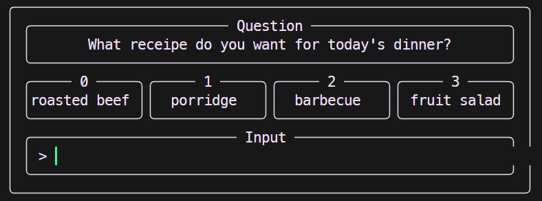
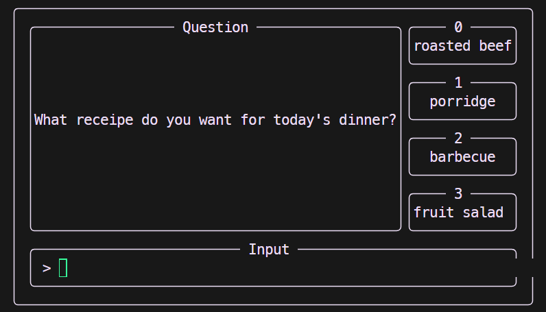
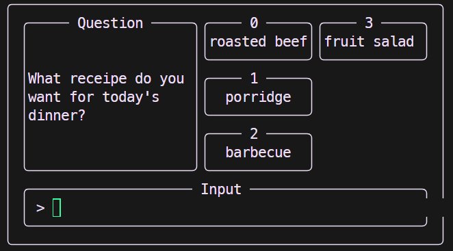
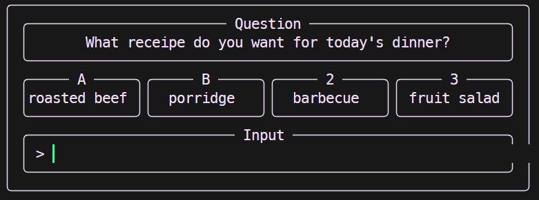
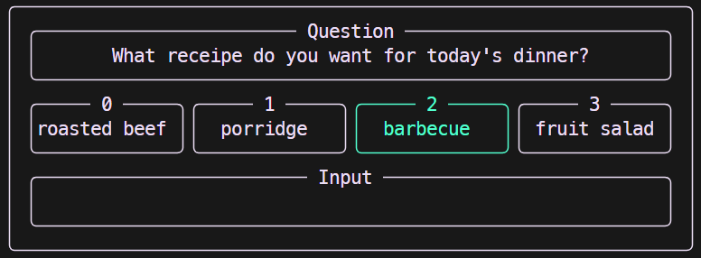

# Fancy Input

[](https://github.com/RichardLitt/standard-readme)

A terminal-based python input tool for asking users with several options and except their input.

# Install

We will package it soon.


# Usage

The input is basically formed with `Option` and `OptionGroup`. To Create a series of Options, you need to

```python
import NumberOption

options = [
    NumberOption("opt1"),
    NumberOption("opt2"),
    NumberOption("opt3")
]
```

this code create a list of `NumberOption`, which serve the numbers as input. Then you need put these option into a `OptionGroup` like follows:

```python
import HorizontalOptionGroup
import NumberOption
options = [
    NumberOption("opt1"),
    NumberOption("opt2"),
    NumberOption("opt3")
]

hop = HorizontalOptionGroup(
	"choose your options"
    *options
)
```

The `OptionGroup` will automatically assign the numbers to every `NumberOption`. Once init is done, you can call `ask()` method to get user input

```
selectedOpt = hop.ask()
```

It returns an `Option` instance, you can get its option label, option content by access its properties

```python
# if user selected the second NumberOption, the printed
# result should be:
# 	1
# 	opt2

print(selectedOpt.opt) 
print(selectedOpt.name)
```


# Example

## HorizontalOptionGroup

The `HorizontalOptionGroup` will output a group with horizontal listed options like following:



To output like this, you can do

```python
gr = HorizontalOptionGroup(
        "What receipe do you want for today's dinner?",
        NumberOption("roasted beef"),
        NumberOption("porridge"),
        NumberOption("barbecue"),
        NumberOption("fruit salad"),
    )
gr.setMaxOptionPerUnit(4)
gr.ask()
```
The method `setMaxOptionPerUnit()` is to set maximum number of options in a single line. For the default situation, this value is 3.

## VerticalOptionGroup

The `VerticalOptionGroup` will output a group with Vertical listed options like following:



To output like this, you should do
```python
gr = VerticalOptionGroup(
        "What receipe do you want for today's dinner?",
        NumberOption("roasted beef"),
        NumberOption("porridge"),
        NumberOption("barbecue"),
        NumberOption("fruit salad"),
    )
gr.setMaxOptionPerUnit(4)
gr.ask()
```
The method `setMaxOptionPerUnit()` is to set maximum number of options in a single Column. For the default situation, this value is 3.

In the `VerticalOptionGroup`, you can manually adjust the width of question box by:
```python
gr = VerticalOptionGroup(
        "What receipe do you want for today's dinner?",
        NumberOption("roasted beef"),
        NumberOption("porridge"),
        NumberOption("barbecue"),
        NumberOption("fruit salad"),
    )
gr.setMaxLengthOfQuestion(15)
gr.ask()
``` 
This will output a layout like this:



## Default Selection
Both `VerticalOptionGroup` and `HorizontalOptionGroup` support setting a certain option as the default selection. To enable this feature, you should do:
```python
gr = VerticalOptionGroup(
        "What receipe do you want for today's dinner?",
        NumberOption("roasted beef"),
        NumberOption("porridge"),
        NumberOption("barbecue"),
        NumberOption("fruit salad"),
    )
gr.setDefaultOption(0)
gr.setMaxLengthOfQuestion(15)
gr.ask()
```
In this way, the Option with the index 0 will be the default selection. Once user directly input enter without anything, this default option will be selected. 

What you need to pay attention is that the index is the order of `Option` in the constructor, not the option number displayed on every option. If you mixed use `NumberOption` and `AsciiOption`, this may bring some cofusions. You can also putting a reference of `Option` to assgin the default selection like this:
```python
defaultOption = NumberOption("porridge")
gr = VerticalOptionGroup(
        "What receipe do you want for today's dinner?",
        NumberOption("roasted beef"),
        defaultOption,
        NumberOption("barbecue"),
        NumberOption("fruit salad"),
    )
gr.setDefaultOption(defaultOption)
gr.setMaxLengthOfQuestion(15)
gr.ask()
```

## Mix Use of Option
We designed Two type of Options: `NumberOption` and `AsciiOption`. You can create a `OptionGroup` with `AsciiOption` by
```python
gr = HorizontalOptionGroup(
        "What receipe do you want for today's dinner?",
        AsciiOption("A","roasted beef"),
        AsciiOption("B","porridge"),
        NumberOption("barbecue"),
        NumberOption("fruit salad"),
    )
gr.setMaxOptionPerUnit(4)
gr.ask()
```
This will looks like:



You can find that the last two `NumberOption` is labeled with 2 and 3, not 0 and 1.

# User Input Behavior
We explain the user input behavior with following example:
```python
gr = HorizontalOptionGroup(
        "What receipe do you want for today's dinner?",
        NumberOption("roasted beef"),
        NumberOption("porridge"),
        NumberOption("barbecue"),
        NumberOption("fruit salad"),
    )
gr.setMaxOptionPerUnit(4)
gr.ask()
```


In this example, no default selection is assigned. If User input a number not belonging to the options listed here, the input would be erased and user is asked to re-input. Once user input a valid option, the instance of that option will be returned, and the console would highlight user's selection:



# License

[MIT](LICENSE) © MintCoffeeCat